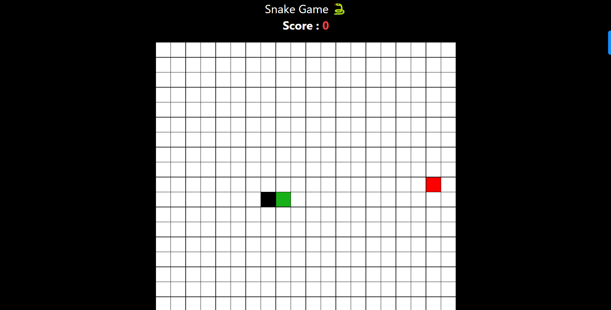

# Weather App

Enjoy a classic gaming experience with our Snake Game! Built using React, TypeScript, and Tailwind CSS, this nostalgic game lets you control a snake as it grows longer and faster. Dive into hours of fun as you maneuver through the grid and challenge your reflexes to achieve the highest score. Are you ready to embrace the challenge and become the ultimate snake master?

## Deployed Link

[Link](https://snake-game-beta-topaz.vercel.app/)

## Technologies

The project uses the following technologies and frameworks:

- HTML
- CSS
- Javascript
- Typescript
- React.js
- TailwindCSS
- React router
- Redux-toolkit

## Installation

Provide instructions on how to install and set up your project locally. Include any prerequisites or dependencies required. For example:

1. Clone the repository: `https://github.com/ignitinsharma/snake-game.git`
2. Install dependencies: `yarn`
3. Start the development server: `yarn dev`

## Screenshots

- Home Page \*

- Game Board Page \*

